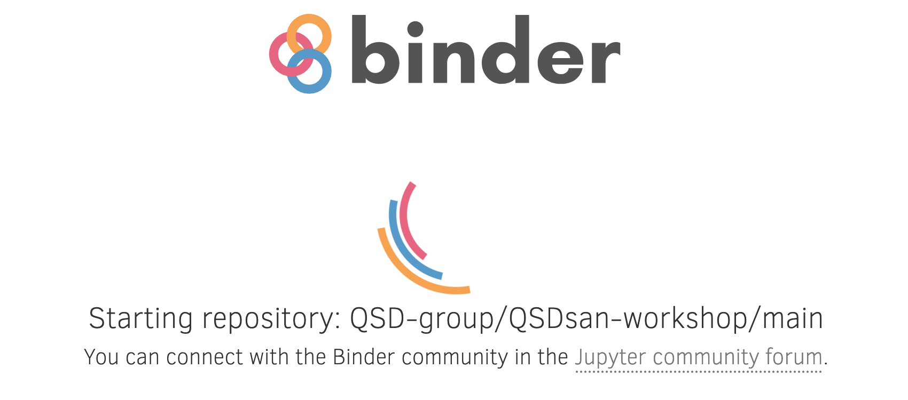
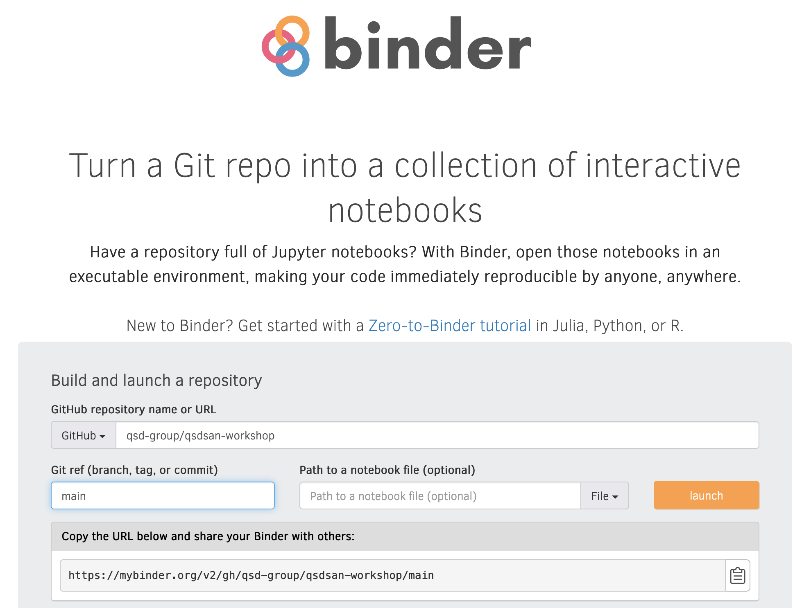

# QSDsan-workshop

## What is this repo for?
This repository contains materials initially developed for the QSDsan workshop on April 22, 2022 during the [27th Environmental Engineering and Science Symposium](https://publish.illinois.edu/2022-environmentalsymposium/) and updated for later workshops. You can find the recording of the [EES Symposium workshop](https://youtu.be/C4Wk2bhsvnk) and a [demo video](https://youtu.be/YCUxNg3zRyE) at our YouTube channel. Slides used for this workshop can be viewed and downloaded through [this link](https://uofi.box.com/s/ysjoo1dfmddrhkdp8xttmlggaa9k9ubl).

**Materials includes:**
- Jupyter Notebook examples (see below on how to run these notebooks interactively in your browser)
    - Example_complete.ipynb (fully populated with additional notes)
    - Example_interactive.ipynb (interactive module that does not require any coding skills)
- Python modules to construct the systems and analyses, including:
    - country_specific.py (country-specific analysis)
    - models.py (uncertainty and sensitivity analyses)
    - systems.py (systems)
- data folder with data used in the analysis (e.g., location-specific parameters)
- results folder with results generated from the analysis
- repository organizing and configuration files (``files`` folder, README.md, runtime.txt, etc.)

## Launch binder to run the workshop examples in your browser
Click on the badge: 

**Note:**

If the binder page gets stuck and you keep seeing this image:

 

Try to go directly to the [binder homepage](https://mybinder.org), fill in ``qsd-group/qsdsan-workshop`` in the ``GitHub▼`` box, and ``main`` in the ``Git ref`` box, then click the yellow ``launch`` button, this seems to work better under certain conditions.

